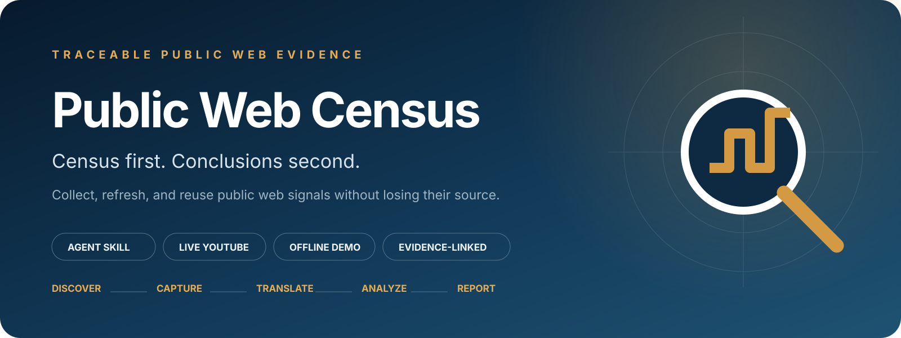
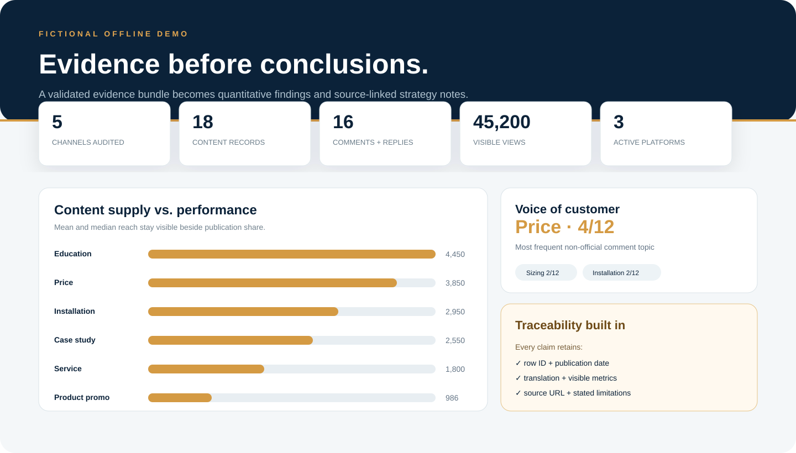

<p align="center">
  
</p>

<p align="center">
  <a href="https://github.com/KayZhongyi/public-web-census/actions/workflows/ci.yml"></a>
  <a href="LICENSE"></a>
  <a href="https://github.com/KayZhongyi/public-web-census/stargazers"></a>
  <a href="README.zh-CN.md">中文</a>
</p>

**Turn public web signals into refreshable, traceable evidence.**

Public Web Census is a clone-and-run Agent Skill and project CLI for collecting and reusing public web evidence. Give it a company, brand, product, account, or research question; it helps discover relevant channels, collect public TikTok profiles and conversations, Facebook Page posts, or YouTube metadata and selected conversations, preserve stable source records, update an existing evidence base, and hand the data to validated analysis workflows. Teams can reuse the same evidence layer for competitor research, owned-channel monitoring, customer voice, content strategy, presales, and product or service improvement.

> Census first. Conclusions second.

## What it does

| Capability | Result |
|---|---|
| **Platform census** | Find and verify a target's active public channels before choosing where to go deep |
| **Runnable connectors** | Collect TikTok profile videos and selected conversations, Facebook Page posts, or YouTube metadata and selected conversations from one CLI |
| **In-scope capture** | Preserve stable IDs, publication dates, text, views, available engagement fields, account fields, and source URLs |
| **Versioned evidence ledger** | Archive every imported bundle in SQLite-backed observation history without replacing earlier captures |
| **Material-change diff** | Separate new, updated, unchanged, and not-observed records with content, engagement, and metadata changes |
| **Multilingual normalization** | Keep original text beside a separate working translation in one consistent schema |
| **Corpus-grounded classification** | Let an Agent read the complete corpus and derive categories from repeated meanings rather than preset keywords |
| **Reusable analysis** | Compare content performance, study customer needs and reply patterns, or prepare evidence for a declared business question |
| **Customer voice mode** | Derive issue categories, classify intent/sentiment/severity, link visible official replies, and redact public usernames in shareable output |
| **Traceable delivery** | Produce CSV evidence, a declared taxonomy, validation results, and an evidence-linked HTML report |
| **Collaboration handoff** | Move reviewed evidence into a Bitable-style action index and send concise change briefs without exposing the raw corpus |

The same workflow can be reused across companies, languages, regions, and approved collection tools because the evidence schema and analysis layer stay independent from the source platform.

## One evidence base, three decision modes

| Start with | Then use it to answer | Output |
|---|---|---|
| **Baseline census** | Which public channels matter, what is published, and what performs? | Traceable public-source brief |
| **Incremental monitoring** | What materially changed since the last reviewed snapshot? | Evidence-linked change brief, not noisy counter updates |
| **Evidence-grounded personas** | What can public signals support about installers, partners, or end users? | Explicitly bounded personas with source IDs, counter-evidence, and confidence |

This is not another “scrape and summarize” tool. SQLite keeps an append-only observation history while `current/` remains a rebuildable CSV/JSON view. Translation, analysis, reports, monitoring, and approved collaboration handoffs can be rerun without overwriting the original capture. Read [`references/versioned-evidence-store.md`](references/versioned-evidence-store.md) for the storage model and [`references/department-recipes.md`](references/department-recipes.md) for cross-team use.

## Versioned workflow

```bash
./public-web-census discover \
  --workspace runs/example \
  --target "Example Company" \
  --market "Singapore" \
  --purpose "Understand public product questions"

./public-web-census collect youtube \
  --workspace runs/example \
  --company "Example Company" \
  --channel "https://www.youtube.com/@Example" \
  --output runs/example-youtube-2026-08

./public-web-census diff --workspace runs/example
./public-web-census validate --workspace runs/example
```

The unified `collect` command runs the existing platform connector and, after a successful capture, archives and ingests the bundle. Existing bundles can be imported with `refresh --workspace ... --bundle ...`.

## Clone, check, run

The offline demo needs no API key, browser login, or package install:

```bash
git clone https://github.com/KayZhongyi/public-web-census.git
cd public-web-census
python3 scripts/run_demo.py
```

Open `demo/output/report.html`, or view the [live fictional report](https://kayzhongyi.github.io/public-web-census/).

<p align="center">
  
</p>

Run the guided live-connector setup, then install the checkout as an Agent Skill:

```bash
./public-web-census setup
./public-web-census doctor
./public-web-census install-skill --target codex
# or: ./public-web-census install-skill --target claude
```

`setup` can offer to install [OpenCLI](https://github.com/jackwener/OpenCLI), open its official Chrome Web Store page, restart the local bridge, and verify the connection. Chrome requires the user to approve the extension and sign into TikTok/Facebook directly; no setup command can or should automate those steps. Add `--with-youtube` to install `yt-dlp` as well. `doctor` provides a read-only recheck later.

## Use the project CLI

```bash
./public-web-census --help
```

One command surface covers discovery, collection, versioned refresh, evidence analysis, and delivery:

```text
./public-web-census setup
./public-web-census doctor
./public-web-census discover ...
./public-web-census collect youtube ...
./public-web-census refresh ...
./public-web-census diff ...
./public-web-census validate ...
./public-web-census snapshot ...
./public-web-census history ...
./public-web-census analyze content ...
./public-web-census tiktok ...
./public-web-census tiktok-comments ...
./public-web-census facebook ...
./public-web-census youtube ...
./public-web-census youtube-comments ...
./public-web-census prepare-analysis ...
./public-web-census apply-analysis ...
./public-web-census prepare-voice ...
./public-web-census apply-voice ...
./public-web-census merge ...
./public-web-census export ...
```

## Collect a TikTok public profile

The TikTok connector reads the rendered public profile grid through an authorized Chrome session. It writes a stable video ID, publication date, original caption, point-in-time view count, and canonical source URL for every retrievable card in scope. It does not download videos or call private TikTok APIs.

Use the guided setup to install OpenCLI, open the official extension page, and verify the browser bridge:

```bash
./public-web-census setup
```

Start with a small field check:

```bash
./public-web-census tiktok \
  --company "Target Company" \
  --profile "@targethandle" \
  --max-scrolls 1 \
  --output runs/target-tiktok-check
```

After checking account identity and the date, caption, view, and link columns, run a wider best-effort census. `--manual-scroll` lets a human finish loading the ordinary public grid if automatic scrolling becomes stagnant:

```bash
./public-web-census tiktok \
  --company "Target Company" \
  --profile "@targethandle" \
  --max-scrolls 100 \
  --manual-scroll \
  --output runs/target-tiktok
```

Deep-read the 30 highest-view captured videos and preserve public comments, visible replies, parent-child structure, comment likes, official identity, and available video-page engagement:

```bash
./public-web-census tiktok-comments \
  --bundle runs/target-tiktok \
  --top 30 \
  --owner "@targethandle" \
  --owner "Target Company"
```

TikTok may present a puzzle before loading comments. The command stops with a resumable checkpoint and leaves the challenge for a human; it never solves or bypasses it. Rerun with `--resume` after manual completion, or use `--wait-for-human` in an interactive terminal. Field provenance, coverage language, selection rules, and limitations are documented in [`references/tiktok-adapter.md`](references/tiktok-adapter.md).

## Collect a Facebook Page feed

The Facebook connector reads public Page posts through a Chrome profile the user is already authorized to use. It captures each visible feed window before scrolling, deduplicates by platform ID or canonical URL, and checkpoints after every round. The current public command covers Page posts; Facebook comments and replies remain a documented extension rather than a shipped connector.

Run the guided setup, approve the official extension in Chrome, log into Facebook normally, and verify the browser bridge:

```bash
./public-web-census setup
```

Start with a small field-verification run:

```bash
./public-web-census facebook \
  --company "Target Company" \
  --page "https://www.facebook.com/TargetPage" \
  --max-scrolls 3 \
  --output runs/target-facebook-check
```

After checking account identity, dates, metrics, and source links, widen the declared scope:

```bash
./public-web-census facebook \
  --company "Target Company" \
  --page "https://www.facebook.com/TargetPage" \
  --max-scrolls 100 \
  --output runs/target-facebook
```

The connector is read-only. It never posts, reacts, comments, follows, or messages. If Facebook presents human verification, it stops and writes a resumable checkpoint; a human must complete the challenge manually, and the connector never bypasses it. See [`references/facebook-adapter.md`](references/facebook-adapter.md) for coverage language, `--bind`, resume behavior, and field details.

## Collect a YouTube channel

The included YouTube connector captures public video metadata without downloading media. Start with a small verification run:

```bash
python3 -m pip install -U "yt-dlp[default]"
./public-web-census youtube \
  --company "OpenAI" \
  --channel "https://www.youtube.com/@OpenAI" \
  --tabs videos \
  --max-items-per-tab 10
```

It writes the evidence bundle, baseline report, run manifest, and an Agent-ready analysis packet to `runs/openai/`.

<p align="center">
  
</p>

After checking the account and fields, run a best-effort census of all retrievable entries in the selected tabs:

```bash
./public-web-census youtube \
  --company "Target Company" \
  --channel "https://www.youtube.com/@TargetHandle" \
  --tabs videos,shorts,streams \
  --max-items-per-tab 0
```

Deep-read the public conversations beneath the highest-view captured videos with the same `yt-dlp` dependency. No Google API key, browser login, cookie, or media download is required:

```bash
./public-web-census youtube-comments \
  --bundle runs/target-company \
  --top 30 \
  --max-comments-per-video 500
```

This writes comment IDs, reply relationships, public display authors, available timestamps, likes, source links, and deterministic official-uploader markers to `comments.csv`, then creates the existing customer-voice packet. Use `--max-comments-per-video 0` only for an explicitly declared all-retrievable scope. Collection remains best effort: disabled, deleted, restricted, reordered, or unreturned comments may be absent. A verification request stops the command; it is never bypassed.

For repeat monitoring, collect a date-bounded update into a new directory and merge by stable ID:

```bash
./public-web-census youtube \
  --company "Target Company" \
  --channel "https://www.youtube.com/@TargetHandle" \
  --since 2026-07-01 \
  --output runs/target-2026-07

python3 scripts/merge_incremental.py \
  --base runs/target-baseline/content.csv \
  --incoming runs/target-2026-07/content.csv \
  --output runs/target-current/content.csv
```

The merge report separates new, updated, unchanged, and absent-from-this-run records without treating absence as deletion. It also records the fields that changed, so a monitoring brief can prioritize a real content or operational change rather than routine engagement-counter drift.

## Complete the analysis with any Agent

Each collection run creates a model-agnostic task at `analysis/analysis_task.md`. Ask your preferred file-capable Agent to follow it, then validate the completed work:

```text
Use $public-web-census to follow runs/openai/analysis/analysis_task.md.
Read the complete corpus, derive the taxonomy, and fill every analysis row.
```

```bash
python3 scripts/apply_analysis.py --bundle runs/openai
```

```text
content.csv (source evidence, unchanged)
  → Agent reads the complete corpus
  → taxonomy.json + analysis_results.csv
  → deterministic validation
  → analyzed_content.csv + analysis_report.html
```

The validator checks the source fingerprint, exact ID coverage, translation completeness, category definitions, confidence values, and representative evidence before producing the analyzed dataset and report.

### Run analysis locally with Ollama

Collection itself is deterministic and does not require an LLM. To replace the cloud Agent for translation and classification, install Ollama and run the bundled structured-output runner:

```bash
ollama pull qwen3:8b
./public-web-census local-analysis \
  --bundle runs/openai/current \
  --mode content \
  --model qwen3:8b
```

The runner batches the corpus, writes the same analysis packet, and invokes the existing fail-closed validator. It uses no OpenAI, Anthropic, or DeepSeek API token. See [`references/local-agent.md`](references/local-agent.md) for the OpenCode interactive option and model trade-offs.

### The Agent does not grade its own work

Agent output is treated as a proposal, not trusted as a finished result. A deterministic **evidence gate** fails closed:

| Gate | Rejects |
|---|---|
| **Source fingerprint** | Analysis prepared against a modified `content.csv` |
| **Exact ID-set comparison** | Omitted source records, duplicate IDs, or invented IDs |
| **Taxonomy and coverage checks** | Blank translations, undeclared categories, incomplete definitions, or mismatched representative evidence |
| **Uncertainty trace** | Invalid confidence values or unexplained low-confidence classifications |

If any gate fails, the tool writes a failure report and does not create `analyzed_content.csv` or the final analysis report. This protects pipeline integrity and traceability; it does not claim that every public statement or model interpretation is objectively true.

## Run customer voice analysis

When an evidence bundle contains public conversations in `comments.csv`, create an independent customer-voice task:

```bash
python3 scripts/prepare_customer_voice.py --bundle runs/target-company
```

Ask any file-capable Agent to follow `voice/voice_task.md`, then validate and render:

```bash
python3 scripts/apply_customer_voice.py --bundle runs/target-company
```

```text
comments.csv + content.csv (source evidence, unchanged)
  → Agent reads the complete customer corpus
  → voice_taxonomy.json + voice_results.csv
  → deterministic validation + official-reply linking
  → analyzed_voice.csv + customer_voice_report.html
```

The mode separates **issue**, **intent**, **sentiment**, and **severity** instead of reducing customer feedback to a positive/negative score. High-severity records require visible justification, and the shareable report replaces public usernames with stable aliases.

## Bring reviewed evidence into the workstream

The report is a decision surface, not the end of the workflow. Keep the raw evidence bundle access-controlled, then create a reviewed index with source links, evidence IDs, findings, owners, and status. A Feishu Bitable can serve as that index; a group card can carry only the new signal, decision, and action needed for the team to respond.

This repository documents the handoff contract rather than shipping a credentialed SaaS integration. A live Feishu sync requires an approved app, minimum scopes, a controlled destination, and secret management. Read [`references/collaboration-handoff.md`](references/collaboration-handoff.md) before implementing it.

## Install as an Agent Skill

Clone once, then link the checkout into the Agent you use:

```bash
git clone https://github.com/KayZhongyi/public-web-census.git
cd public-web-census
./public-web-census install-skill --target codex
# or: ./public-web-census install-skill --target claude
# both: repeat --target codex --target claude
```

Direct cloning into a skill directory also works:

```bash
git clone https://github.com/KayZhongyi/public-web-census.git ~/.codex/skills/public-web-census
# Claude Code: clone to ~/.claude/skills/public-web-census instead
```

Then ask:

```text
Use $public-web-census to research the public channels of [company] in [market].
Build the evidence bundle first, then write a traceable strategy report.
```

The Skill is plain Markdown plus Python standard-library tooling, so other terminal- and browser-capable Agents can use the same workflow. TikTok and Facebook use OpenCLI as an external Apache-2.0 browser bridge; YouTube uses `yt-dlp`. The collection rules, command surface, checkpoints, evidence schema, validation, and reporting code live in this repository. See [`THIRD_PARTY_NOTICES.md`](THIRD_PARTY_NOTICES.md).

## Export a vector PDF

Every report remains an HTML file with clickable evidence links. Export a portable vector PDF with Chrome or Chromium:

```bash
./public-web-census export \
  --html runs/target-company/analysis_report.html \
  --pdf runs/target-company/analysis_report.pdf
```

Keep the CSV and JSON bundle alongside the PDF; the PDF is a presentation layer, not the evidence source.

## What you get

| Artifact | Purpose |
|---|---|
| `platform_census.csv` | Audited accounts, identity evidence, activity, and deep-dive decisions |
| `content.csv` | Source-level public content and point-in-time metrics |
| `comments.csv` | Public conversation evidence and official-reply structure when collected |
| `run_manifest.json` | Scope, cutoff, tools, coverage, and collection record |
| `evidence.sqlite3` | Append-only run, entity, observation, and change history for repeat work |
| `captures/<run-id>/` | Exact archived input bundles with source fingerprints |
| `changes/<run-id>.json` | New, updated, unchanged, and not-observed records for each refresh |
| `current/` | Rebuildable portable CSV/JSON view of the latest observation per stable ID |
| `analysis/taxonomy.json` | Corpus-derived category definitions and representative row IDs |
| `analysis/validation_report.json` | Machine-checkable completeness and integrity result |
| `analyzed_content.csv` | Translation and classification merged without changing source evidence |
| `analysis_report.html` | Management-ready findings with counts, denominators, evidence IDs, and source links |
| `voice/voice_taxonomy.json` | Corpus-derived customer-issue definitions and representative comment IDs |
| `voice/validation_report.json` | Completeness, integrity, and labeling checks for customer voice |
| `analyzed_voice.csv` | Validated customer signals with redacted author aliases and visible-response linkage |
| `customer_voice_report.html` | Issue, intent, sentiment, severity, response, and evidence-led customer voice report |

## Analysis built for decisions

- **Emergent taxonomy:** categories come from the corpus instead of a rigid template.
- **Coverage–performance gap:** publishing share is compared with both mean and median reach.
- **Voice of customer:** concrete needs are counted with visible denominators.
- **Customer signal triage:** issue, intent, sentiment, severity, and confidence remain separate.
- **Response-pattern analysis:** useful answers, templates, redirection, and silence are separated.
- **Opportunity mapping:** high-demand/low-supply themes become testable content and service opportunities.
- **Evidence thresholds:** small or ambiguous samples remain labeled instead of becoming confident prose.

See [`references/analysis-playbook.md`](references/analysis-playbook.md) for competitor analysis, [`references/customer-voice-playbook.md`](references/customer-voice-playbook.md) for customer voice, and [`references/research-modes.md`](references/research-modes.md) for mode selection.

## Designed for trustworthy reuse

- Raw evidence stays separate from translation, classification, and conclusions.
- Stable IDs and source links make every important number auditable.
- Input fingerprints prevent an old analysis from being applied to a changed corpus.
- Shareable customer-voice outputs replace public usernames with stable aliases.
- Human review remains at account verification, platform challenges, and final business judgment.
- Standard CSV/JSON contracts make new approved connectors and report formats easy to add.
- SQLite observations, archived source bundles, and stable IDs support repeat monitoring without overwriting earlier evidence.
- Collaboration handoff preserves an evidence ID and source link instead of turning a group summary into an untraceable conclusion.

Responsible collection guidance lives in [`references/collection-safety.md`](references/collection-safety.md). The included demo is entirely fictional and public-safe.

Contributions are welcome, especially approved connectors, analysis methods, and report themes. See [CONTRIBUTING.md](CONTRIBUTING.md).

## License

[MIT](LICENSE)
