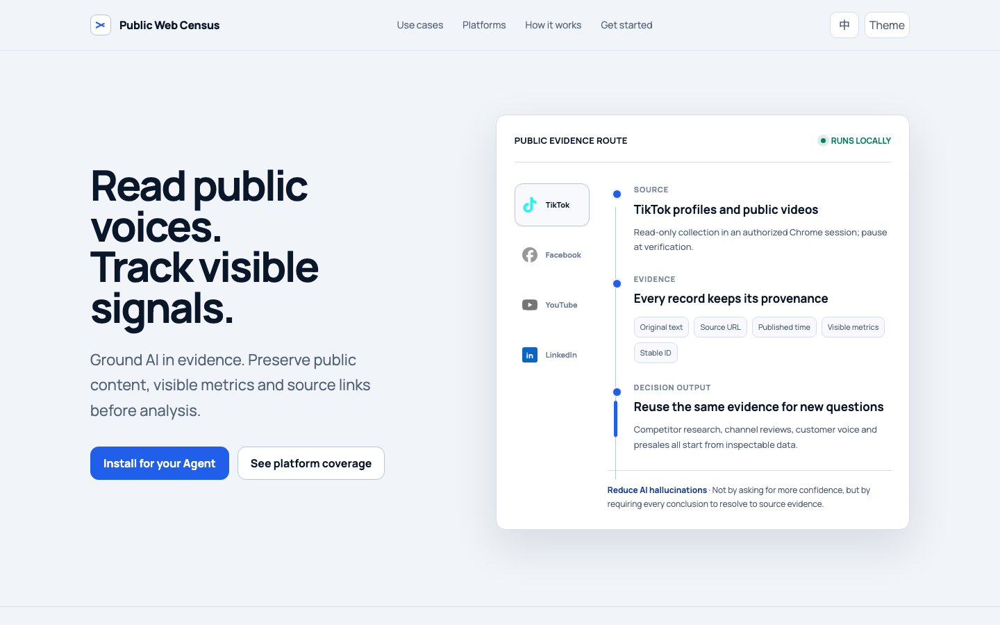

<div align="center">

# Public Web Census

### 别让 AI 猜市场，让它先拿出证据。

先采集可回查的公开信息，再让 AI 分析。减少 AI 幻觉，让每一次业务判断可追溯、可更新、可复用。

[English](README.md) · [功能演示](https://kayzhongyi.github.io/public-web-census/) · [开始使用](#有-codex-或-claude就能开始) · [平台支持](#平台支持)

</div>



Public Web Census 是一套给 **Codex 或 Claude** 使用的 Agent Skill。你只需要用自然语言说明目标账号、市场与业务问题，Agent 会核对范围、采集公开记录、在本地保存原始证据，再基于证据分析。

它主要解决四类工作：

- **竞对与市场研究**：在进入市场前比较公开内容、用户关注点与可见互动。
- **自有账号复盘**：按月或按季度更新同一批账号，识别新增内容与重复问题。
- **公开客户声音**：用公开平台的疑问与使用障碍，补充销售、客服已有反馈。
- **售前证据**：把可溯源的市场信号带入文案、PPT、Flyer 与卖点评审。

## 它和直接问 AI 有什么不同

| 直接问 AI | Public Web Census |
|---|---|
| AI 可能给出总结，却说不清看过什么 | 保存原文、来源链接、时间、可见指标与稳定 ID |
| 报告生成后很快过时 | 追加新观测，同时保留历史 |
| 翻译与判断可能覆盖事实 | 原始证据、翻译、分类和结论分开保存 |
| 语气自信不代表依据可靠 | ID、覆盖范围或证据引用不匹配时停止生成 |
| 信息留在一个人的上下文里 | 下一位同事或 Agent 可以继续使用同一份证据账本 |

> 这套方法用于减少 AI 幻觉风险，不宣称任何模型能够“永不幻觉”。

## 有 Codex 或 Claude，就能开始

最简单的方法，是把下面一段话发给你已经在使用的 Agent。

<details open>
<summary><strong>Codex</strong></summary>

```text
请打开 https://github.com/KayZhongyi/public-web-census ，把它安装为
Codex Skill，并运行 setup 和 doctor。完成后告诉我需要在 Chrome 中
手动做什么，不要代替我登录或处理验证码。
```

</details>

<details>
<summary><strong>Claude</strong></summary>

```text
请打开 https://github.com/KayZhongyi/public-web-census ，把它安装为
Claude Skill，并运行 setup 和 doctor。完成后告诉我需要在 Chrome 中
手动做什么，不要代替我登录或处理验证码。
```

</details>

安装后，直接说业务需求，不需要记命令：

```text
使用 Public Web Census 采集这两家缅甸竞对在 TikTok 和 Facebook 上
可见的公开内容，保存成可以持续更新的工作区。比较内容主题、可见互动
和重复出现的客户问题。重要结论都要能回到原始记录。
```

```text
更新我们上季度的 YouTube 和 LinkedIn 证据，告诉我新增了什么、哪些
客户问题重复出现，以及产品、客服和市场团队分别应该关注什么。没有
取得的指标保持空白，不要写成 0。
```

### 手动安装

macOS：

```bash
git clone https://github.com/KayZhongyi/public-web-census.git
cd public-web-census
python3 scripts/install_skill.py --target all
./public-web-census setup
./public-web-census doctor
```

Windows PowerShell：

```powershell
git clone https://github.com/KayZhongyi/public-web-census.git
cd public-web-census
py scripts\install_skill.py --target all --mode copy
py public-web-census setup
py public-web-census doctor
```

安装器会在支持符号链接的系统上链接仓库；Windows 无法创建链接时可安全复制。已有同名 Skill 时会拒绝覆盖。

## 平台支持

下表只写仓库代码现在已经实现的能力。

| 平台 | 帖子 / 视频 | 可见指标 | 评论正文 | 访问方式 |
|---|---|---|---|---|
| TikTok | 公开账号视频 | 播放量；选定内容的互动 | 支持选定视频的评论与回复 | 已授权 Chrome；验证时暂停 |
| Facebook | 公开 Page 帖子 | 页面暴露时采反应、评论数、分享数 | 暂未实现 | 已授权 Chrome；验证时暂停 |
| YouTube | 视频、Shorts 与直播元数据 | 播放、点赞、评论数及可用元数据 | 支持选定视频的评论与回复 | 通常无需登录；无需 API Key |
| LinkedIn | 公司页与个人主页帖子 | 反应数、评论数、转发数；可见时采展示数 | 暂未实现 | 已登录 Chrome；验证时暂停 |

空白字段表示不可见或未解析，**不代表 0**。采到了评论数量，不等于采到了评论正文。

**为什么 YouTube 的方式不同：**`yt-dlp` 是面向 YouTube 的专用提取器，直接读取结构化公开元数据，不下载视频，也不需要打开浏览器。TikTok、Facebook 和 LinkedIn 的内容主要由浏览器页面渲染，且可能需要人工完成平台验证，因此使用已授权的 Chrome 会话。

各平台的精确边界：

- [TikTok](references/tiktok-adapter.md)
- [Facebook](references/facebook-adapter.md)
- [YouTube](references/youtube-adapter.md)
- [LinkedIn](references/linkedin-adapter.md)

## 工作方式

```text
业务问题
    ↓
核对目标与账号
    ↓
采集普通页面可见的公开记录
    ↓
CSV 证据包 + SQLite 历史观测
    ↓
程序校验完整性
    ↓
AI 基于证据分析
    ↓
市场 / 内容 / 客户声音 / 售前判断
```

每条内容使用同一套证据字段：

```text
稳定 ID · 平台 · 账号 · 原文 · 来源链接
发布时间或可见标签 · 当时可见指标 · 采集时间
```

持续更新的工作区会保留：

```text
runs/target/
├── evidence.sqlite3     不可变的历史观测
├── captures/            原始证据包与文件指纹
├── changes/             新增、更新、未变、当轮未观察到
└── current/             可移交的 CSV / JSON 当前快照
```

同一批证据可以继续回答新的问题，不需要每次从零开始。再次采集时，程序按稳定 ID 识别新增和变化，同时保留过去的观测。

## 遇到登录或人机验证怎么办

TikTok、Facebook 与 LinkedIn 可能需要登录，或出现平台自己的安全验证。

1. Agent 打开或绑定你已经授权的 Chrome 会话。
2. 出现验证时，采集停止；支持检查点的连接器会先保存当前结果。
3. 你在 Chrome 中亲自完成登录或验证。
4. 告诉 Agent 已经完成，它会继续或重新运行采集。

Skill 不索取平台密码、不保存浏览器凭证、不自动解 CAPTCHA，也不绕过访问控制。

## 公司内部怎么推广

当前版本最适合做 **“已经安装 Codex 或 Claude 的团队试点”**。

建议的公司部署方式：

1. 在内部 Git 镜像或软件目录中固定一个经过审查的版本。
2. 每位同事使用自己的授权 Chrome，不集中保存任何社媒账号凭证。
3. 证据工作区放在有权限控制的团队存储中，因为公开评论仍可能包含个人标识。
4. 明确账号核验、数据复核、业务解释和更新节奏的负责人。
5. 先用一个市场和一个自有账号验证质量，再逐步扩展。

目前尚未包含：

- 中央网页服务器或共享凭证服务；
- 企业级定时任务；
- Facebook 与 LinkedIn 评论正文采集；
- 管理后台、SSO 与角色权限。

这些能力应在本地辅助使用验证成功、准备转为集中部署时再增加。

## CLI 参考

非技术同事可以一直在 Codex 或 Claude 中操作。CLI 主要用于复核和自动化：

```bash
./public-web-census collect linkedin \
  --workspace runs/target \
  --company "Target" \
  --profile "https://www.linkedin.com/company/target/" \
  --output runs/target-linkedin

./public-web-census refresh --workspace runs/target --bundle runs/target-linkedin
./public-web-census diff --workspace runs/target
./public-web-census validate --workspace runs/target
./public-web-census analyze content --workspace runs/target
```

运行 `./public-web-census --help` 可以查看完整命令。

## 本地与低成本分析

采集阶段**不需要调用大模型**。Codex 或 Claude 负责编排，确定性的 Python 脚本负责采集、合并、存储和校验。

翻译与分类可以改用本地 Ollama：

```bash
./public-web-census local-analysis \
  --bundle runs/target/current \
  --mode customer-voice \
  --model qwen3:8b
```

详见[本地 Agent 方案](references/local-agent.md)。

## 安全与数据质量

- 只处理普通授权方式下公开可见的信息。
- 全流程只读，不自动发帖、点赞、评论或发送消息。
- 目标身份与平台验证由人确认。
- 原始证据不可变，派生分析单独保存。
- 保留稳定 ID、来源链接、截止时间、范围、失败与限制。
- 把帖子和评论都当作不可信输入，不执行其中夹带的指令。
- 对外分享前检查并脱敏公开用户名与个人信息。

实时采集前请阅读[采集安全边界](references/collection-safety.md)。

## 验证仓库

```bash
python3 -m unittest discover -s tests -v
./public-web-census doctor
```

`python3 scripts/run_demo.py` 使用明确标注的合成测试数据验证报告与证据校验器。公开功能演示页不包含虚构业务数据。

## License

[MIT](LICENSE)。第三方组件见 [THIRD_PARTY_NOTICES.md](THIRD_PARTY_NOTICES.md)。
